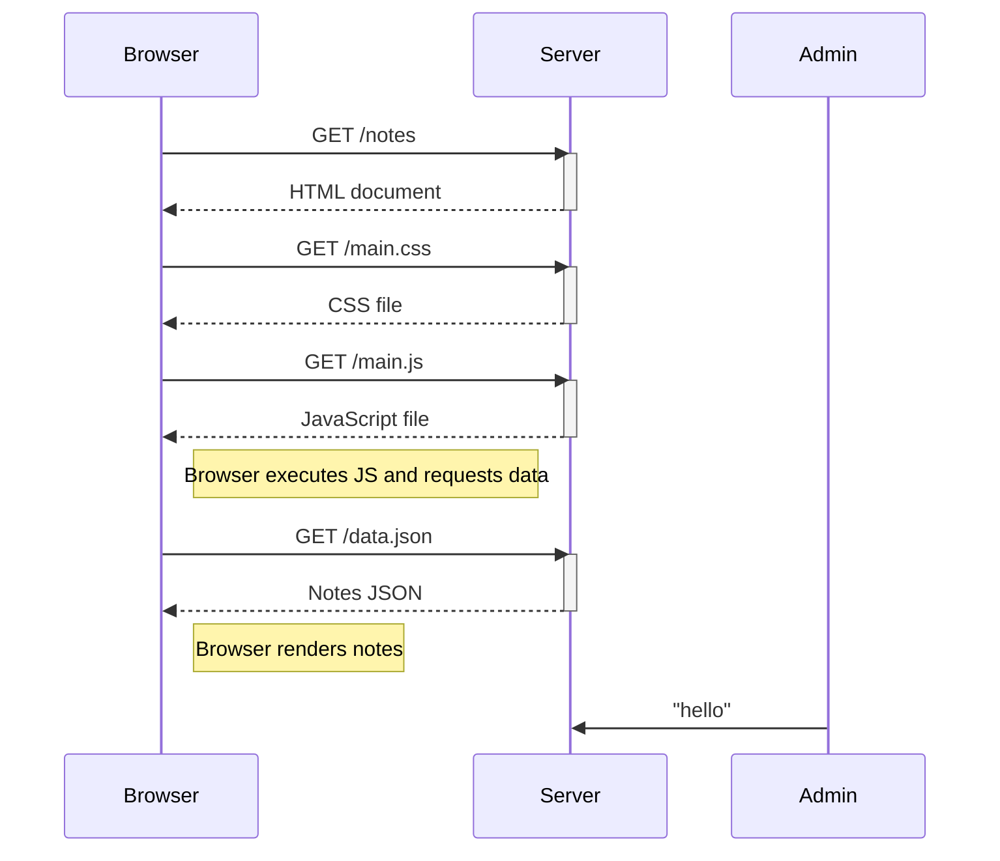

```mermaid
sequenceDiagram
    participant Browser
    participant Server
    participant Admin

    Browser->>Server: GET /notes
    activate Server
    Server-->>Browser: HTML document
    deactivate Server

    Browser->>Server: GET /main.css
    activate Server
    Server-->>Browser: CSS file
    deactivate Server

    Browser->>Server: GET /main.js
    activate Server
    Server-->>Browser: JavaScript file
    deactivate Server

    Note right of Browser: Browser executes JS and requests data

    Browser->>Server: GET /data.json
    activate Server
    Server-->>Browser: Notes JSON
    deactivate Server

    Note right of Browser: Browser renders notes

    %% Admin sends message
    Admin->>Server: "hello"

```

